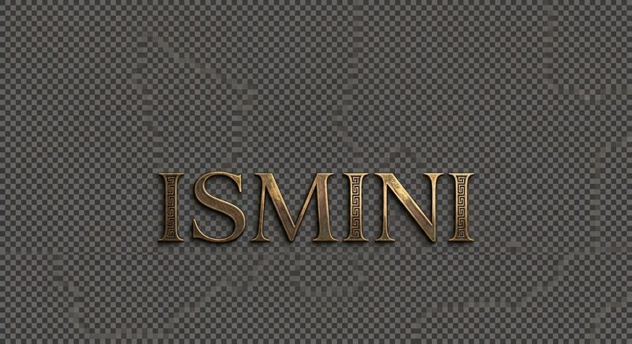
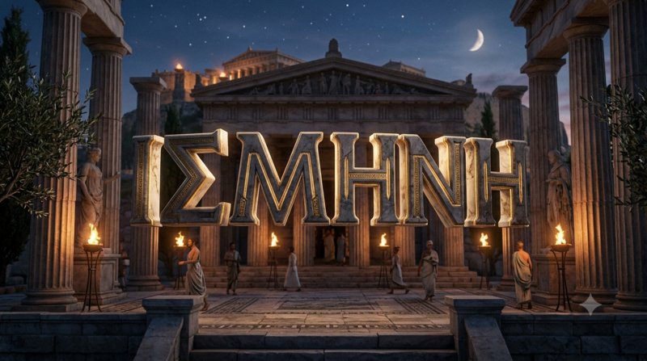
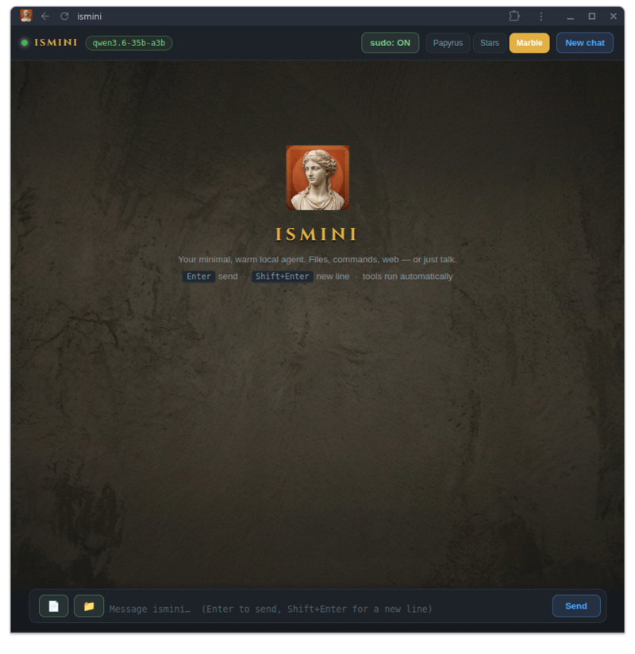
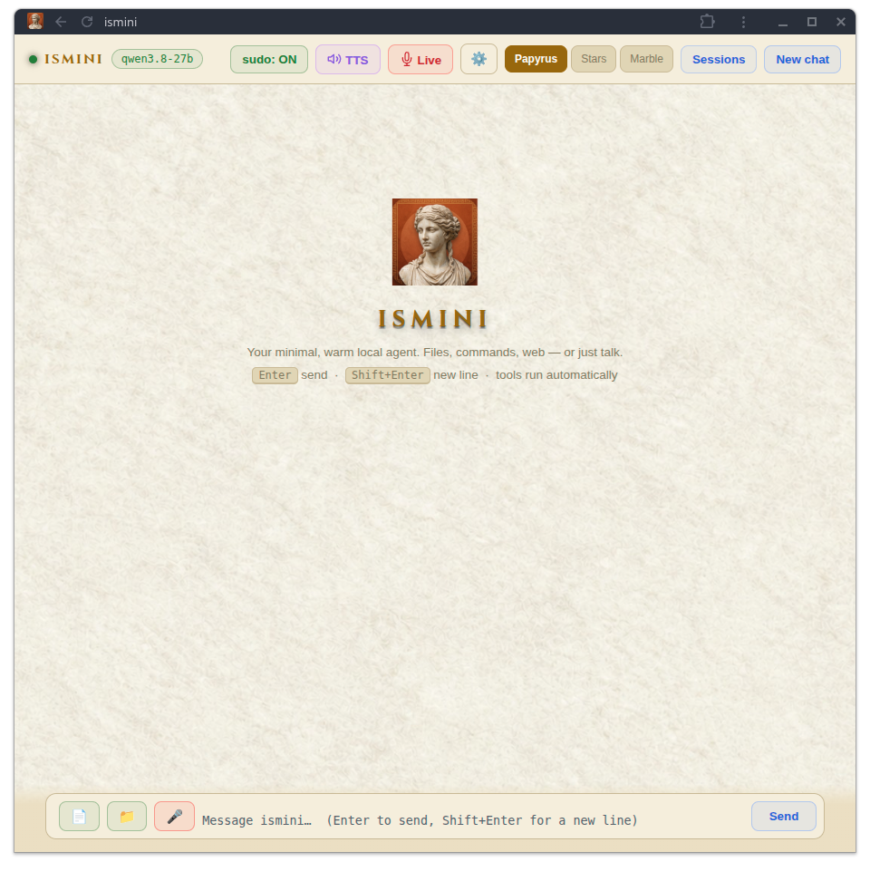
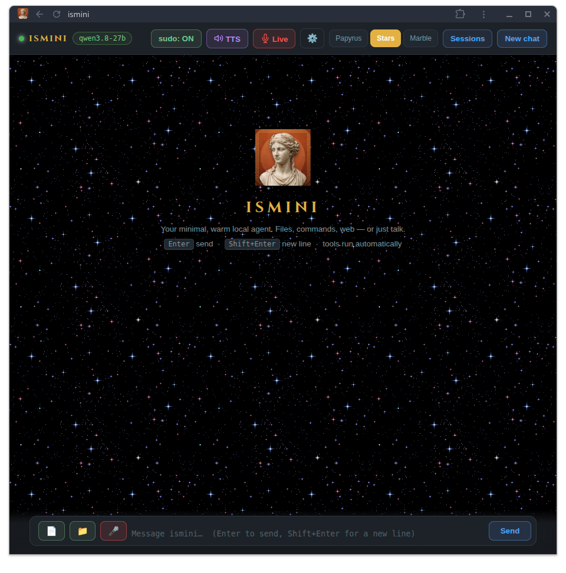

 

### A Minimal AI Agent

---

## ✨ What is ismini?

ismini is a lightweight, minimal AI agent that runs locally on your machine. No bloat, no cloud dependency — just a clean agent with web tools at your fingertips.

---

## 📦 Get It

| Platform | Repository | Status |
|:--------:|:----------:|:------:|
| 🐧 | [**ismini-linux**](https://github.com/tasosdelotas/ismini-linux) | ✅ Live |
| 🪟 | [**ismini-windows**](https://github.com/tasosdelotas/ismini-windows) | ✅ Live |

---

## 📸 Screenshots

### Main Interface

 

### Themes

**Marble**

 

**Papyrus**

 

**Stars**

---

## 📄 License

[MIT](LICENSE)

---

**Built with ❤️ by [tasosdelotas](https://github.com/tasosdelotas)**

